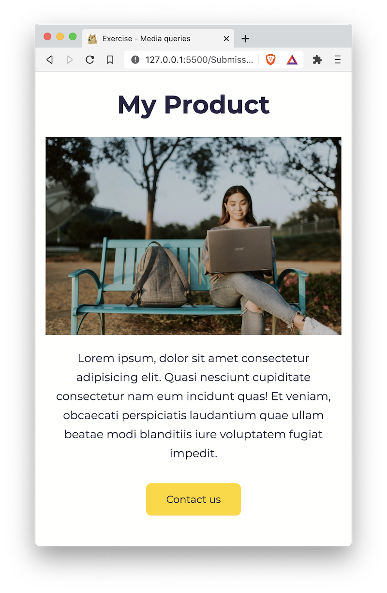
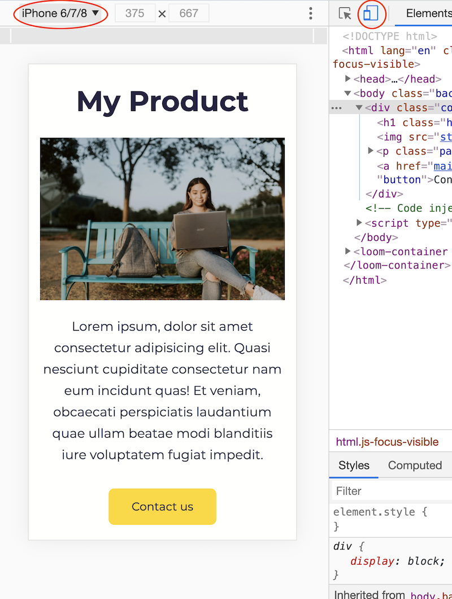

# 01 Exercise - Responsive Web Design

Use fluid layouts, flexible images, and media queries to make a web page responsive.

---

## Exercise Brief

Take a basic web page, and make it responsive using CSS. View an [example on Vimeo](https://vimeo.com/457412544/5b469aa3a8).

---

## Rationale

Understanding how to utilise fluid layouts, flexible images and media queries allow you to create Responsive web pages, that work on any sized device.

---

## Getting Started

1. `clone` the exercise repository to your local computer using VS Code or the Terminal.
2. The code for this exercise should go into `/Submission/static/css/style.css`.

---

## Exercise Part A - Make the image flexible

1. Open `/Submission/index.html` in your browser, and open the [Device Toolbar](https://developers.google.com/web/tools/chrome-devtools/device-mode/) in your developer tools

   

2. Choose a mobile device from the dropdown. Notice how the image is too large for the screen and goes off the page?
3. Open `/Submission/static/css/style.css` in VS Code. Find the `/* Part A: Make the image responsive */` section in the file, and add your CSS to make the image flexible. You can reference [How TO - Responsive Images](https://www.w3schools.com/howto/howto_css_image_responsive.asp), and the [Media Query example](https://codepen.io/lwcooper/pen/jOqxjoK) from the class meeting.
4. Check your image is flexible by changing the width of your browser, and ensuring the image resizes to fit inside the browser window

**Acceptance criteria**

- The image width never exceeds the browser width (see [example on Vimeo](https://vimeo.com/457412498/332fbe809d))

## Exercise Part B - Tablet design

When the browser width gets larger, change the colour scheme of the web page.

- Use [Media Query example](https://codepen.io/lwcooper/pen/jOqxjoK) on CodePen as a reference for this exercise.
- Keeping in mind the Mobile First design philosophy, we will add extra styles for larger screens by writing `min-width` media queries, and not repeating CSS.

When the browser width reaches `48rem`, change the colour scheme to match the following specification:

| selector                    | declaration                              |
| --------------------------- | ---------------------------------------- |
| `.background`               | `background: #fec7d7`                    |
| `.heading,` `.paragraph` | `color: #0e172c`                         |
| `.button`                   | `color #fffffe` `background: #0e172c` |

View an [example on Vimeo](https://vimeo.com/457412544/5b469aa3a8).

Add your code to the `Part B and C` section of the CSS file.

**Acceptance criteria**

- When the browser width reaches `48rem`, the colour scheme matches the specification for tablet
- Only `min-width` media queries are used
- There are no duplicated CSS declarations in the media queries

## Exercise Part C - Desktop design

When the browser width reaches `64rem`, change the colour scheme to match the following specification:

| selector      | declaration                              |
| ------------- | ---------------------------------------- |
| `.background` | `background: #16161a`                    |
| `.heading`    | `color: #fffffe`                         |
| `.paragraph`  | `color: #94a1b2`                         |
| `.button`     | `color #fffffe` `background: #7f5af0` |

View an [example on Vimeo](https://vimeo.com/457412544/5b469aa3a8).

**Acceptance criteria**

- When the browser width reaches `64rem`, the colour scheme matches the specification for desktop
- Only `min-width` media queries are used
- There are no duplicated CSS declarations in the media queries

---

# Submit your Exercise

- [ ] Push your code to GitHub by typing `git push`
- [ ] "Mark as done" in Google Classroom

# Walkthrough Solution Video
[Video](https://www.loom.com/share/f83559dc98024c0d9859196021c5fdff)
